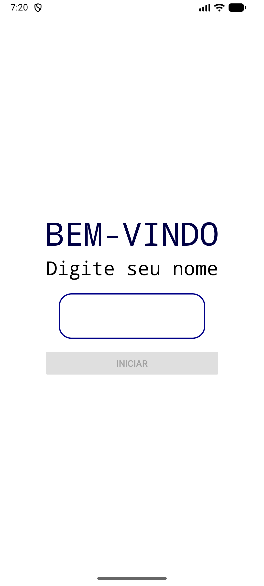

Tecnologia em Análise e Desenvolvimento de Sistemas

Setor de Educação Profissional e Tecnológica - SEPT

Universidade Federal do Paraná - UFPR

---

*DS151 - Desenvolvimento para Dispositivos Móveis*

Prof. Alexander Robert Kutzke

# Avaliação Prática: Flag Game

Bem-vindo ao **Flag Game**! O projeto base fornecido a você já possui a estrutura inicial configurada na pasta `src/` e o modo de jogo principal (Modo Normal) funcional em termos de lógica de acertos.

Sua tarefa nesta avaliação é **estender o aplicativo** consumindo uma API REST para salvar e listar as pontuações, além de implementar um novo modo de jogo (Temporizado) utilizando os recursos fornecidos.

## 📁 Estrutura do Projeto

* `src/app/`: Contém as telas e rotas do Expo Router (`index.tsx`, `game.tsx`).
* `src/hooks/`: Contém o hook `useCronometro.ts` já pronto para você utilizar.
* `src/data/`: Contém o array de países no arquivo `countries.js`.

## 🚀 O que você deve implementar (Tarefas)

A avaliação é dividida em 3 etapas principais:

### 1. Salvar Pontuação no Modo Normal (30 Pontos)
O código atual do `src/app/game.tsx` já permite jogar 10 rodadas, mas não salva os dados. 
* **Tarefa 1:** Ao final do jogo (rodada 10), realize uma requisição `POST` na API local (instruções abaixo) enviando Nome e a Pontuação final. A tela de Fim de Jogo só deve aparecer após o salvamento.

### 2. Criar a Tela de Placar (30 Pontos)
* **Tarefa:** Crie uma nova tela (ex: `src/app/placar.tsx`) acessível através da tela inicial. Esta tela deve realizar requisições `GET` na API para buscar e exibir as pontuações usando uma `FlatList`.
* **Interface:** Para simplificar, não utilize bibliotecas de abas complexas. Crie dois botões simples no topo da tela ("Placar Normal" e "Placar Temporizado"). Ao clicar neles, atualize um estado e busque a lista correspondente na API.

### 3. Modo Temporizado (40 Pontos)
* **Tarefa:** Crie uma nova tela para o jogo temporizado (ex: `src/app/game-timed.tsx`). Você pode copiar a lógica do `game.tsx` como base, mas a condição de parada muda. Não utilize 10 rodadas. O jogo deve rodar até o tempo acabar.
* **Cronômetro:** Utilize o hook `useCronometro` fornecido na pasta `src/hooks/`. Ele inicia uma contagem regressiva de 30 segundos.
* **Fim de Jogo:** Quando o tempo do hook chegar a `0`, o jogo deve parar imediatamente e realizar o `POST` enviando os dados para a rota de *timedscores*.

## Telas da aplicação



---

## 💾 Configuração da API Local (json-server)

Nesta avaliação, simularemos um banco de dados real rodando uma API REST no seu próprio computador através do `json-server`.

**Passo 1: Instalação e Criação do Banco**
Abra um terminal (separado do terminal onde o Expo rodará) na raiz do projeto e crie um arquivo chamado `db.json` com a seguinte estrutura inicial vazia:

```json
{
  "scores": [],
  "timedscores": []
}
```

**Passo 2: Iniciar o Servidor**
Rode o comando abaixo no terminal para iniciar o servidor na porta 3000:

```bash
npx json-server --watch db.json --port 3000
```

**Passo 3: Como consumir a API no React Native**
A API estará rodando em `http://localhost:3000`.
⚠️ **AVISO MUITO IMPORTANTE:** Se você estiver testando o aplicativo no seu celular físico (Expo Go), o celular não entende o que é `localhost`. Você **deve** usar o endereço IP da sua máquina na rede Wi-Fi. Exemplo: `http://192.168.1.15:3000/scores`.

**Endpoints da API:**

| Método | URL (Exemplo usando IP local) | Descrição |
| --- | --- | --- |
| GET | `http://localhost:3000/scores` | Retorna as pontuações do modo normal do GRR especificado. |
| GET | `http://localhost:3000/timedscores` | Retorna as pontuações do modo temporizado do GRR. |
| POST | `http://localhost:3000/scores` | Salva uma nova pontuação (Modo Normal). |
| POST | `http://localhost:3000/timedscores` | Salva uma nova pontuação (Modo Temporizado). |

**Estrutura esperada no corpo (Body) do POST:**

```json
{
  "name": "Maria Silva",
  "score": 8
}

```

---

## 🛠️ Recursos Fornecidos

**1. O Hook `useCronometro`**
Para facilitar a implementação da Etapa 3, o arquivo `src/hooks/useCronometro.ts` já exporta a lógica de tempo. Exemplo de uso:

```javascript
import { useCronometro } from '../hooks/useCronometro';

export default function TelaJogoTemporizado() {
  const tempoRestante = useCronometro(30, () => {
    // Esta função será executada automaticamente quando chegar a 0
    console.log("Tempo acabou! Chamar a API e finalizar o jogo.");
  });

  // Mostre a variável {tempoRestante} na sua interface
}

```

**2. Imagens e Bandeiras**
A lista dos países está no arquivo `src/data/countries.js`.
As bandeiras são geradas a partir da API pública [FlagsCDN](https://flagscdn.com/). Apenas passe a URL montada diretamente para a propriedade `source={{ uri: ... }}` do componente `<Image />`. Não é necessário fazer requisição para baixar a imagem.

**3. Manipulação de Arrays (Underscore.js)**
Se precisar embaralhar as alternativas, você pode usar a biblioteca `underscore-esm-min.js` (já inclusa). Exemplo: `_.shuffle(array)` e `_.sample(array, n)`.

---

## 🏁 Inicialização e Entrega

1. Faça o fork/clone do repositório.
2. Instale as dependências e inicie o expo:

```bash
npm ci
npx expo start -c
```

3. Inicie o `json-server` em outro terminal.
```bash
npx json-server --watch db.json --port 3000
```

## Entrega

1. Adicione os usuários da dupla (se houver) ao repositório no github;
2. Adicione o usuário do professor (alexkutzke) ao repositório no github;
3. Envie o link do repositório na tarefa existente na UFPRVirtual.
